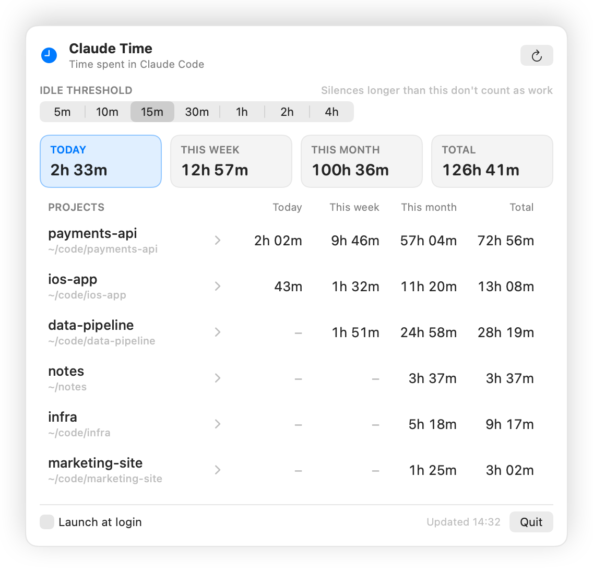
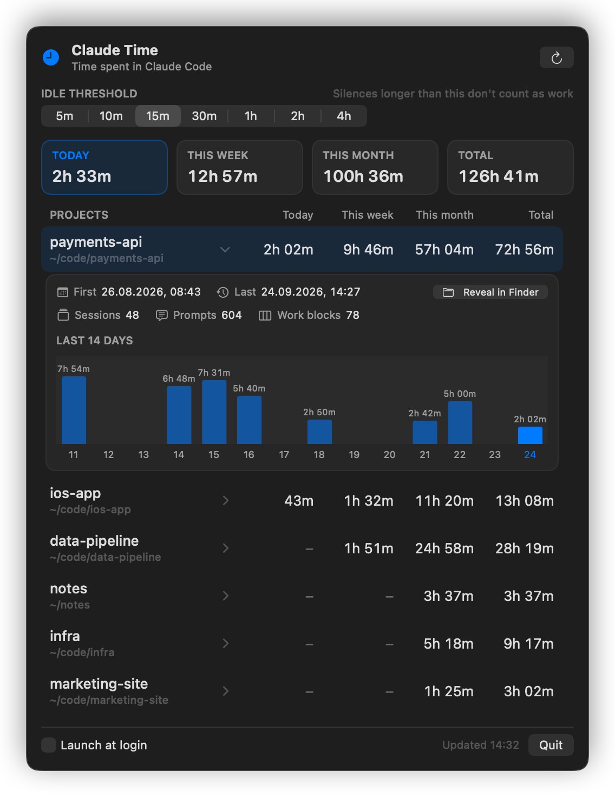

# Claude Time

[](https://github.com/zgrgrcn/claude-time/actions/workflows/ci.yml)

See how much time you spend in Claude Code, per project. Claude Time is a macOS menu bar app and CLI that works it out locally from the transcripts Claude Code already writes.

<p align="center">
  <picture>
    <source media="(prefers-color-scheme: dark)" srcset="docs/screenshot-dark.png">
    
  </picture>
</p>

> Claude Time is an independent project and is not affiliated with Anthropic. See [Disclaimer](#disclaimer).

## Features

- **Today's total in the menu bar**, across all projects, refreshed every minute.
- **A table of projects** with today, this week, this month and total, most recently active first.
- **Project details** on click: first and last activity, sessions, prompts, work blocks, a 14-day chart and Reveal in Finder.
- **Adjustable idle threshold**, from 5 minutes to 4 hours. Every number updates instantly.
- **A `claude-time` CLI** with an overview table, a daily breakdown per project and JSON output.
- **Nothing to set up.** No hooks, plugins, API keys or accounts: it reads the transcripts Claude Code already keeps, so your existing history shows up right away.
- **Private.** Everything runs on your Mac; nothing goes over the network.
- **Fast.** A byte-level scanner and a per-file cache.
- Launch at login, light and dark mode, a universal binary for Apple silicon and Intel, macOS 14 or later.

<p align="center">
  
</p>

## How time is measured

Every line of a Claude Code transcript has a timestamp: your prompts, Claude's replies, tool calls and their results. For each project, Claude Time merges the timestamps of all its sessions (subagent transcripts included) into one timeline. Gaps between consecutive timestamps that are no longer than the **idle threshold** (15 minutes by default) count as work. Longer silences don't.

```
  09:00              09:40                             10:25        10:50
  ●● ●●●  ●●●● ●  ●●●●  ●●                             ●●● ●●  ●●●● ●●● ●
  └──────── 40m ─────────┘   45m, no activity: idle    └───── 25m ──────┘
                                                       = 1h 05m, 2 work blocks
```

What this means in practice:

- Time Claude spends working on its own (running tools, editing files) counts, because new entries keep arriving.
- A break longer than the threshold doesn't count.
- Parallel sessions in the same project aren't double counted, because they share one timeline.
- **All projects** (the menu bar, the four summary cards and the CLI's `ALL (merged)` row) merges every project into one timeline the same way. An hour with two projects open in parallel counts once there, but once in each project's row, so the total can be less than the sum of the rows.
- The clock stops at the last entry of a stretch, so reading Claude's final answer isn't counted.
- Today starts at local midnight, This week on Monday and This month on the 1st. Total covers every transcript still on disk (see [why it may stop at about 30 days](#why-does-my-history-stop-after-about-30-days)).
- A project is the folder you started Claude Code in, and it's named after that folder; rename it under the gear button, and the CLI shows that name too. Folders with the same name count as one project, so a project checked out at different paths (or on different Macs, see [`--export`](#cli-usage)) shows up once. Projects with less than a minute of activity are hidden.

In the project details:

- **Sessions** are the transcript files directly in the project's folder. Subagent transcripts are counted as time but not as sessions.
- **Prompts** are user messages with plain-text content. That's mostly what you typed, but it also includes slash-command records, compaction summaries and task prompts Claude sends to subagents, so treat it as an approximation.
- **Work blocks** are the uninterrupted stretches: a new block starts after each silence longer than the threshold.

## Privacy

- **100% local.** The app and the CLI make no network requests: no analytics, no telemetry, no update checks.
- **Reads only what it needs.** Claude Time reads `~/.claude/projects/**/*.jsonl` (or a folder you point it at). Instead of parsing the JSON, it searches each file for three markers and keeps only the timestamps, the working directory (`cwd`) and the number of plain-text user messages. The text of your prompts, Claude's replies, code and tool output are never stored or shown.
- **Never modifies transcripts.** It doesn't change or delete anything under `~/.claude`.
- **What it writes:** a cache in `~/Library/Caches/claude-time/` holding each file's size, modification time, working directory, timestamps and message count. The default folder uses `cache.json`, and any other folder gets its own `cache-<hash>.json`. You can delete them at any time; they're rebuilt on the next scan. The app also saves the idle threshold and your project names in its preferences (`com.zgrgrcn.claude-time`) and registers a login item only if you turn on Launch at login.

## Performance

- Transcripts are memory-mapped and searched byte by byte (`memmem`) for `"timestamp":"`, `"cwd":"` and the user-message marker. Timestamps are parsed straight from the bytes, with no JSON decoding.
- Results are cached per file, keyed by size and modification time, so a refresh only re-reads the files that changed: usually just the session you're in.
- On an Apple silicon Mac, a full scan of about 1 GB of transcripts takes roughly a second (longer when the files aren't in the disk cache yet). After that, a refresh takes a fraction of a second. The app scans once a minute and whenever you click refresh.

## Install

Get the zips from the [latest release](https://github.com/zgrgrcn/claude-time/releases/latest). Both are universal binaries for macOS 14 or later. To check the downloads, run `shasum -a 256 -c SHA256SUMS` in the folder that holds them.

### Menu bar app

1. Download `ClaudeTime-0.1.0-macos-universal.zip`, unzip it and move `ClaudeTime.app` to `/Applications`.
2. Open it. The app is signed ad hoc but not notarized by Apple, so macOS blocks the first launch:
   - **macOS 14 Sonoma:** in Finder, Control-click (or right-click) `ClaudeTime.app`, choose **Open**, then click **Open** again.
   - **macOS 15 Sequoia and later:** Control-click → Open no longer bypasses the check. Try to open the app once and close the warning. Then go to **System Settings → Privacy & Security**, scroll down, click **Open Anyway** (it shows for about an hour after the blocked attempt) and confirm.
   - **Any version,** from Terminal:
     ```sh
     xattr -dr com.apple.quarantine /Applications/ClaudeTime.app
     ```
3. A clock with today's total appears in the menu bar. There's no Dock icon. Click the clock to open the window, and tick **Launch at login** to start it automatically.

### CLI

```sh
unzip claude-time-0.1.0-macos-universal.zip
mkdir -p ~/.local/bin && mv claude-time ~/.local/bin/
claude-time --version
```

`~/.local/bin` needs to be on your `PATH`. For zsh, run `echo 'export PATH="$HOME/.local/bin:$PATH"' >> ~/.zshrc`, or move the binary to `/usr/local/bin` instead. If macOS refuses to run the downloaded binary, clear its quarantine flag with `xattr -d com.apple.quarantine ~/.local/bin/claude-time`.

### Build from source

You need macOS 14 or later and Xcode 15 or later (or the Command Line Tools with Swift 5.9 or later).

```sh
git clone https://github.com/zgrgrcn/claude-time.git
cd claude-time
swift build && swift test
Scripts/make-app.sh             # build/ClaudeTime.app and .build/release/claude-time
Scripts/make-app.sh --install   # also install to /Applications, link ~/.local/bin/claude-time, launch
Scripts/make-release.sh         # universal zips and SHA256SUMS in dist/, then verifies them
```

`--install` quits a running Claude Time and replaces `/Applications/ClaudeTime.app`.

### Uninstall

Turn off **Launch at login**, click **Quit**, then delete `/Applications/ClaudeTime.app` and `~/.local/bin/claude-time`. To remove the cache and settings too, run `rm -rf ~/Library/Caches/claude-time` and `defaults delete com.zgrgrcn.claude-time`.

## CLI usage

```sh
claude-time                        # all projects: today, this week, this month, total
claude-time payments               # daily breakdown of projects whose name or path contains "payments"
claude-time --days 30 payments     # the same over the last 30 days
claude-time --idle 30              # count silences of up to 30 minutes as work
claude-time --json > time.json     # everything as JSON
claude-time --root ~/other/projects             # read a different transcripts folder
CLAUDE_TIME_ROOT=~/other/projects claude-time   # same, through the environment
claude-time --no-cache             # rescan every file, without reading or writing the cache
claude-time --export ~/Library/Mobile\ Documents/com~apple~CloudDocs/claude-time   # usage-only copy, see below
claude-time --help
```

`--export <dir>` writes a copy of every transcript that holds only what Claude Time reads: the working directory, the timestamps and one empty marker per prompt. Prompt text, replies, code and tool output aren't copied. Run it on each Mac into a synced folder such as iCloud Drive, then read all of them together with `--root <dir>`. Unchanged files are skipped and nothing is ever deleted from `<dir>`, so it also keeps history Claude Code has since cleaned up.

With [demo data](#development) it looks like this. Dates and times follow your region settings.

```
$ claude-time
Project            Today  This week  This month     Total   Last activity
─────────────────────────────────────────────────────────────────────────────
payments-api      2h 02m     9h 46m     57h 04m   72h 56m   24.09.2026, 14:27
ios-app              43m     1h 32m     11h 20m   13h 08m   24.09.2026, 14:23
data-pipeline          –     1h 51m     24h 58m   28h 19m   21.09.2026, 15:43
notes                  –          –      3h 37m    3h 37m   19.09.2026, 12:14
infra                  –          –      5h 18m    9h 17m   10.09.2026, 12:17
marketing-site         –          –      1h 25m    3h 02m   5.09.2026, 11:28
─────────────────────────────────────────────────────────────────────────────
ALL (merged)      2h 33m    12h 57m    100h 36m  126h 41m

idle threshold 15m · 6 projects · 122 files scanned, 0 from cache · 0.06s
```

```
$ claude-time payments-api
payments-api  (~/code/payments-api)
  First: 26.08.2026, 08:43   Last: 24.09.2026, 14:27
  Sessions: 48   Prompts: 604   Work blocks: 78
  Today 2h 02m · This week 9h 46m · This month 57h 04m · Total 72h 56m

  Last 14 days:
  Fri, Sep 11   7h 54m  ██████████████████████████████
  Sat, Sep 12        –
  Sun, Sep 13        –
  Mon, Sep 14   6h 48m  ██████████████████████████
  Tue, Sep 15   7h 31m  █████████████████████████████
  Wed, Sep 16   5h 40m  ██████████████████████
  Thu, Sep 17        –
  Fri, Sep 18   2h 50m  ███████████
  Sat, Sep 19        –
  Sun, Sep 20        –
  Mon, Sep 21   2h 42m  ██████████
  Tue, Sep 22   5h 00m  ███████████████████
  Wed, Sep 23        –
  Thu, Sep 24   2h 02m  ████████

idle threshold 15m
```

### JSON output

`--json` prints the matching projects plus `allProjects`, which is the merged timeline of those projects and so isn't the sum of the rows. Durations are in seconds, timestamps are ISO 8601 in UTC, and `daily` lists local calendar days, oldest first, for the last `--days` days (14 by default). Keys are sorted.

```jsonc
{
  "allProjects": { /* same fields as a project, with "name" and "path" set to "*" */ },
  "generatedAt": "2026-09-24T11:25:00Z",
  "idleMinutes": 15,
  "projects": [
    {
      "daily": [
        { "day": "2026-09-23", "seconds": 0 },
        { "day": "2026-09-24", "seconds": 6352.4 }
      ],
      "firstSeen": "2026-08-26T05:43:59Z",
      "lastSeen": "2026-09-24T09:32:16Z",
      "monthSeconds": 204470.5,
      "name": "payments-api",
      "path": "/Users/you/code/payments-api",
      "prompts": 602,
      "sessions": 47,
      "todaySeconds": 6352.4,
      "totalSeconds": 261580.7,
      "weekSeconds": 34160.1
    }
  ]
}
```

## Use cases

- **Client timesheets.** Keep each client's work in its own folder and turn the JSON into hours per day:
  ```sh
  claude-time --json --days 31 acme | jq -r '.projects[0].daily[] | [.day, (.seconds / 3600 * 100 | round / 100)] | @csv'
  ```
- **Side projects.** See how many evenings and weekends a side project really takes.
- **Weekly reviews.** Look at this week's hours per project before you plan the next week:
  ```sh
  claude-time --json | jq -r '.projects[] | "\(.name)\t\(.weekSeconds / 3600 * 10 | round / 10)h"'
  ```
- **Effort per feature.** Projects are keyed by folder, so a feature built in its own git worktree (for example with `claude --worktree feature-auth`) shows up as a project of its own.
- **Overwork and late nights.** The 14-day chart, the daily breakdown and Last activity make long days, weekends and late finishes easy to spot.
- **Team reporting.** Everyone runs `claude-time --json` on their own Mac and shares the output, with no server or account involved. Combine the files with `jq` or a spreadsheet.

Claude Time measures time with Claude Code active. It doesn't cover the rest of your work, and it says nothing about how productive that time was.

## FAQ

### Why doesn't the total match a stopwatch?

Claude Time only counts the gaps between transcript entries that are no longer than the idle threshold. Time before your first prompt, time spent reading the last answer and breaks longer than the threshold aren't counted. Stretches where Claude keeps working while you're away are counted, as long as entries keep arriving. The All projects figures merge overlapping sessions, so they come out lower than the sum of the rows when you work on several projects in parallel.

### Which idle threshold should I use?

The default of 15 minutes suits most interactive work. Pick 5 or 10 minutes to count only active back and forth with Claude. Pick 30 minutes to 1 hour if you usually review, test or think for a while between prompts and want that included. For billing, choose one value and stick with it. The threshold is applied when the numbers are computed, so changing it recalculates your whole history instantly. The app remembers your choice; the CLI takes `--idle <minutes>`.

### Why does my history stop after about 30 days?

Claude Code deletes transcripts older than its `cleanupPeriodDays` setting, which defaults to 30 days, and Claude Time can only count what's still on disk. To keep more history, raise the setting in `~/.claude/settings.json`:

```json
{
  "cleanupPeriodDays": 3650
}
```

The minimum is 1, and `0` is rejected as invalid, so use a large number for long retention (see the [Claude Code settings reference](https://code.claude.com/docs/en/settings-reference#cleanupperioddays)). Transcripts that were already deleted can't be brought back.

### I set CLAUDE_CONFIG_DIR. How do I point Claude Time at my transcripts?

With `CLAUDE_CONFIG_DIR`, Claude Code keeps its transcripts in `$CLAUDE_CONFIG_DIR/projects`. Run `claude-time --root "$CLAUDE_CONFIG_DIR/projects"`, or set `CLAUDE_TIME_ROOT` to that folder. Apps started from Finder or at login don't see shell variables, so quit Claude Time and start it from Terminal: `open --env CLAUDE_TIME_ROOT="$CLAUDE_CONFIG_DIR/projects" -a ClaudeTime`.

### Will a Claude Code update break it?

The transcript format is internal to Claude Code and can change between versions. Claude Time relies on very little of it: the `timestamp` and `cwd` fields and the shape of plain-text user messages. If a release changes those, times or prompt counts may be off until Claude Time is updated.

### Does it use my Claude plan or API tokens?

No. It only reads files on your disk.

## Development

- `Sources/ClaudeTimeCore` scans transcripts, does the time math and formatting, and parses the CLI options. It's covered by the unit tests.
- `Sources/ClaudeTimeCLI` is the `claude-time` command.
- `Sources/ClaudeTimeApp` is the SwiftUI `MenuBarExtra` app.

```sh
swift run claude-time              # the CLI, on your own transcripts
swift run ClaudeTime               # the menu bar app, without building a bundle
Scripts/make-demo-data.sh          # synthetic transcripts for six fictional projects, in a temp folder
.build/debug/ClaudeTime --snapshot out.png --root <demo folder> [--dark] [--select payments-api] [--idle 30]
Scripts/make-screenshots.sh        # regenerate the images and CLI sample in docs/ from demo data
```

Snapshot mode renders the app's window to a PNG and exits. It never reads or writes the cache or your settings, so it's safe to point at demo data. The version number lives in `Sources/ClaudeTimeCore/Version.swift`, and the build scripts copy it into the app's `Info.plist`.

## Disclaimer

Claude Time is an independent project and is not affiliated with, endorsed by, or sponsored by Anthropic. Claude and Claude Code are trademarks of Anthropic, PBC.

## License

[MIT](LICENSE) © 2026 Ozgur Gurcan
